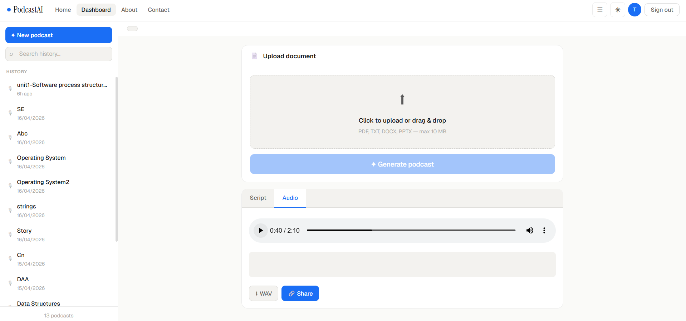

# AI Podcast Generator

## Overview

AI Podcast Generator is a web application that transforms documents into engaging podcast-style conversations using Artificial Intelligence.

Users can upload PDF, DOCX, PPTX, or TXT files, and the system automatically:

* Extracts document content
* Filters irrelevant or boilerplate text
* Summarizes key information
* Generates a natural conversation between two AI hosts
* Converts the conversation into realistic speech audio

The application is designed to make learning and consuming information easier through AI-generated podcasts.

## Features

### Document Upload

Supports:

* PDF
* DOCX
* PPTX
* TXT

### OCR Support

Automatically extracts text from scanned PDF documents using:

* Tesseract OCR
* PDF2Image

### AI-Powered Summarization

Uses Groq LLM to:

* Analyze document content
* Generate concise summaries
* Preserve important concepts and findings

### Podcast Script Generation

Creates a natural conversation between two virtual hosts:

* Alex
* Jordan

The generated dialogue explains the uploaded content in an engaging and easy-to-understand format.

### Text-to-Speech Conversion

Uses ElevenLabs AI voices to convert podcast scripts into high-quality audio.

### User Authentication

* User Registration
* User Login
* JWT-based Authentication
* Protected API Endpoints

### Podcast Management

Users can:

* View previously generated podcasts
* Rename podcasts
* Delete podcasts
* Access podcast history

### Share Podcasts

Generate public share links that allow anyone to view and listen to generated podcasts.

## Technology Stack

### Frontend

* HTML
* CSS
* JavaScript

### Backend

* Python
* Flask
* Flask-CORS

### Database

* MongoDB Atlas

### AI Services

* Groq API
* ElevenLabs API

### OCR

* Tesseract OCR
* PDF2Image

### Authentication

* JWT (JSON Web Tokens)
* Bcrypt Password Hashing

## Workflow

1. User uploads a document.
2. Text is extracted from the file.
3. OCR is used when required.
4. Boilerplate content is removed.
5. Content is divided into chunks.
6. Groq AI generates summaries.
7. Summaries are converted into a podcast conversation.
8. ElevenLabs generates speech audio.
9. Podcast is saved to MongoDB.
10. User can listen, share, rename, or delete podcasts.

## UI Overview
